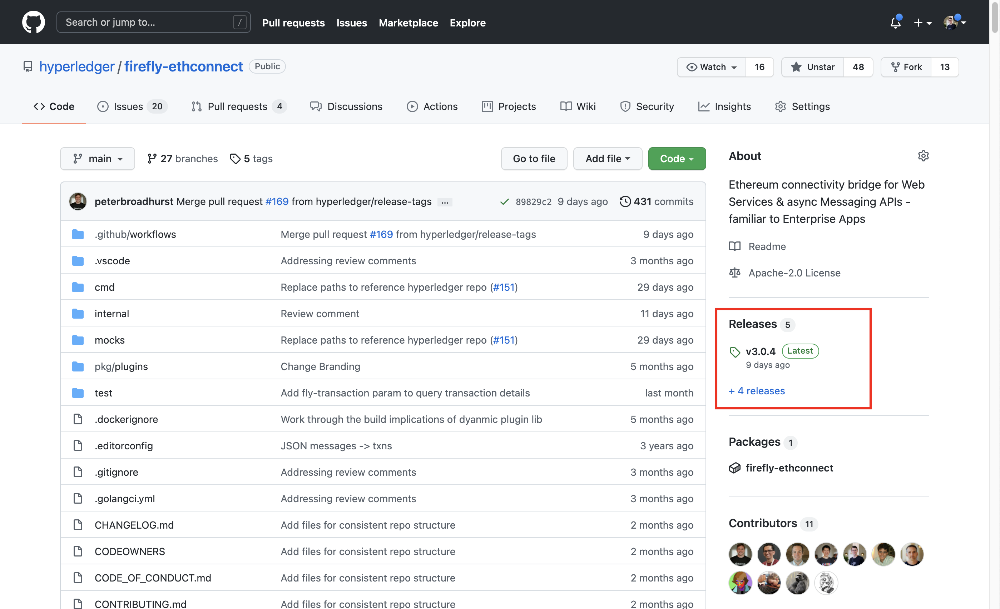
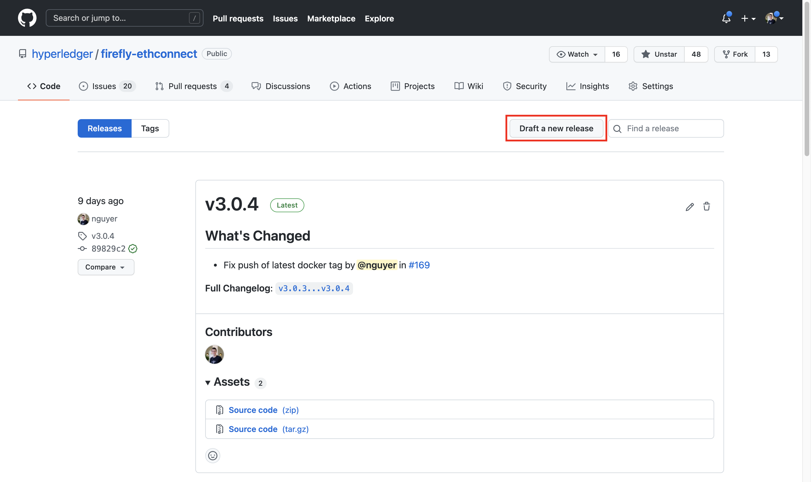
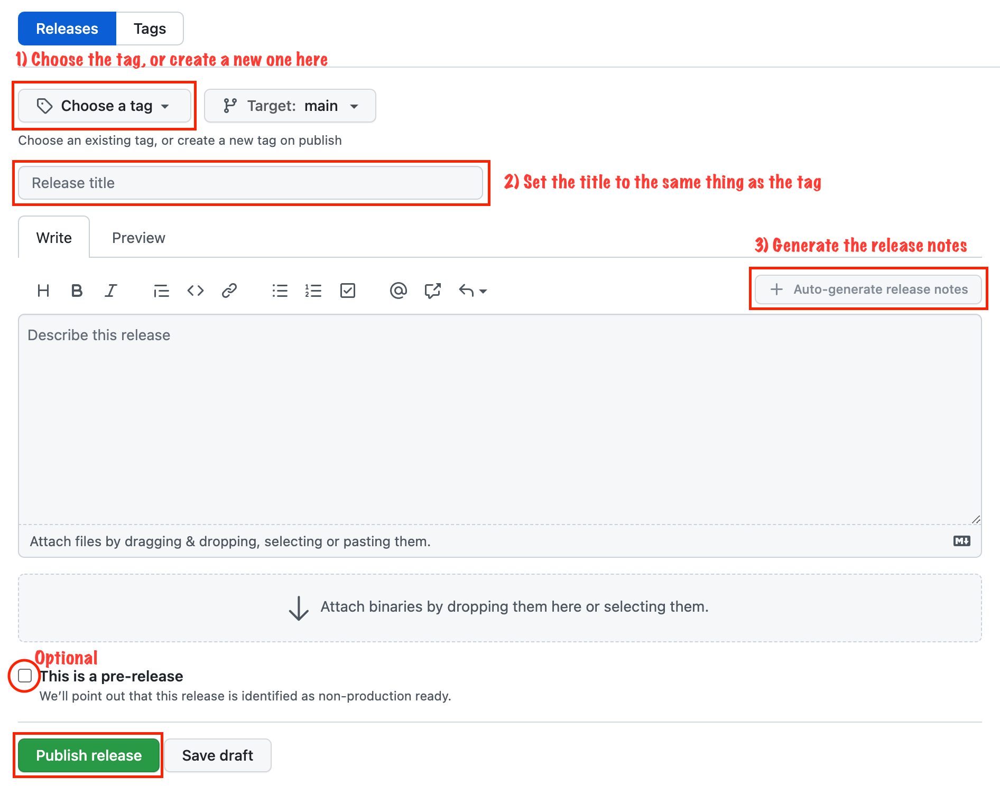
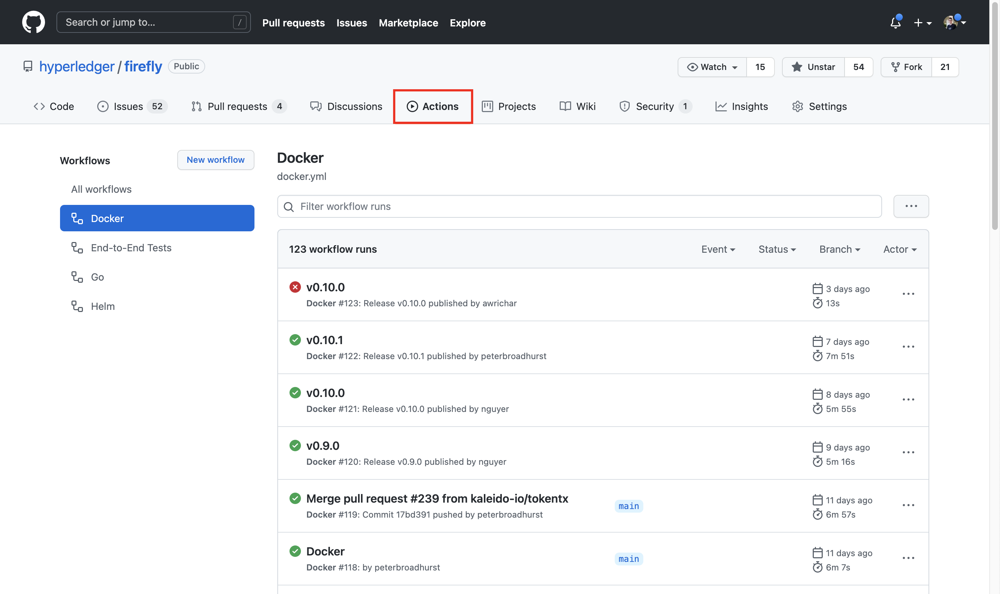

# Release Guide

This guide will walk you through creating a release.

---

## Versioning scheme

FireFly follows semantic versioning. For more details on how we determine which version to use please see the [Versioning Scheme guide](version_scheme.md).

## The `manifest.json` file

FireFly has a [`manifest.json` file in the root of the repo](https://github.com/hyperledger/firefly/blob/main/manifest.json). This file contains a list of versions (both tag and sha) for each of the microservices that should be used with this specific commit. If you need FireFly to use a newer version of a microservice listed in this file, you should update the `manifest.json` file, commit it, and include it in your PR. **This will trigger an end-to-end test run, using the specified versions.**

Here is an example of what the `manifest.json` looks like:

```json
{
  "ethconnect": {
    "image": "ghcr.io/hyperledger/firefly-ethconnect",
    "tag": "v3.0.4",
    "sha": "0b7ce0fb175b5910f401ff576ced809fe6f0b83894277c1cc86a73a2d61c6f41"
  },
  "fabconnect": {
    "image": "ghcr.io/hyperledger/firefly-fabconnect",
    "tag": "v0.9.0",
    "sha": "a79a4c66b0a2551d5122d019c15c6426e8cdadd6566ce3cbcb36e008fb7861ca"
  },
  "dataexchange-https": {
    "image": "ghcr.io/hyperledger/firefly-dataexchange-https",
    "tag": "v0.9.0",
    "sha": "0de5b1db891a02871505ba5e0507821416d9fa93c96ccb4b1ba2fac45eb37214"
  },
  "tokens-erc1155": {
    "image": "ghcr.io/hyperledger/firefly-tokens-erc1155",
    "tag": "v0.9.0-20211019-01",
    "sha": "aabc6c483db408896838329dab5f4b9e3c16d1e9fa9fffdb7e1ff05b7b2bbdd4"
  }
}
```

> **NOTE**: You can run `make manifest` in the FireFly core source directory, and a script will run to automatically get the latests non-pre-release version of each of FireFly's microservices. If you need to use a snapshot or pre-release version you should edit `manifest.json` file manually, as this script will not fetch those versions.

## Creating a new release

Releases and builds are managed by GitHub. New binaries and/or Docker images will automatically be created when a new release is published. The easiest way to create a release is through the web UI for the repo that you wish to release.

### 1) Navigate to the release page for the repo



### 2) Click the `Draft a new release` button



### 3) Fill out the form for your release



It is recommended to start with the auto-generated release notes. Additional notes can be added as-needed.

## Automatic Docker builds

After cutting a new release, a GitHub Action will automatically start a new Docker build, if the repo has a Docker image associated with it. You can check the status of the build by clicking the "Actions" tab along the top of the page, for that repo.


