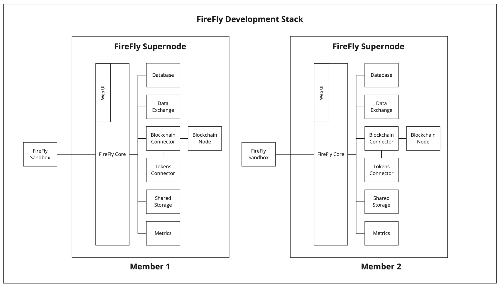
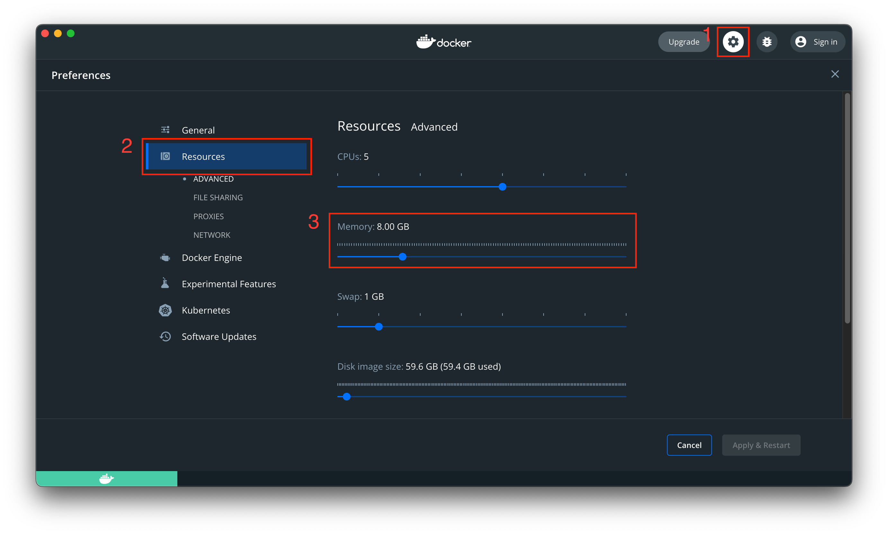
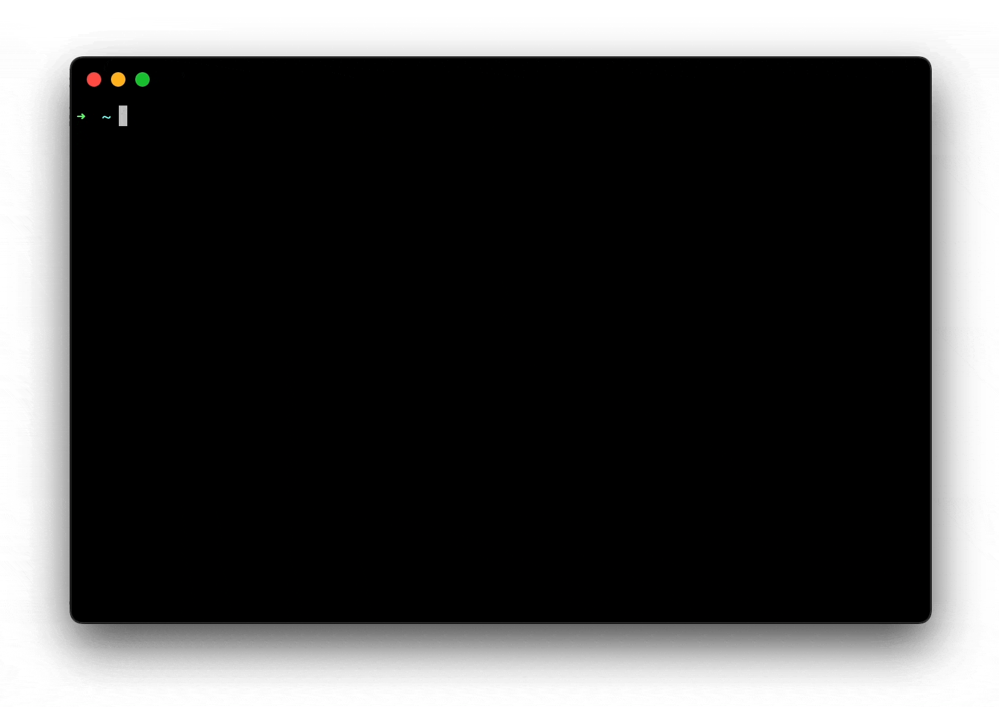

# Start your environment

## Previous steps: Install the FireFly CLI

If you haven't set up the FireFly CLI already, please go back to the previous step and read the guide on how to [Install the FireFly CLI](./firefly_cli.md).

[← ① Install the FireFly CLI](firefly_cli.md){: .md-button .md-button--primary}

Now that you have the FireFly CLI installed, you are ready to run some Supernodes on your machine!

## A FireFly Stack

A FireFly stack is a collection of Supernodes with networking and configuration that are designed to work together on a single development machine. A stack has multiple members (also referred to organizations). Each member has their own Supernode within the stack. This allows developers to build and test data flows with a mix of public and private data between various parties, all within a single development environment.



The stack also contains an instance of the FireFly Sandbox for each member. This is an example of an end-user application that uses FireFly's API. It has a backend and a frontend which are designed to walk developers through the features of FireFly, and provides code snippets as examples of how to build those features into their own application. The next section in this guide will walk you through using the Sandbox.

## System Resources

The FireFly stack will run in a `docker-compose` project. For systems that run Docker containers inside a virtual machine, like macOS, you need to make sure that you've allocated enough memory to the Docker virtual machine. **We recommend allocating 1GB per member.** In this case, we're going to set up a stack with **3 members**, so please make sure you have **at least 3 GB** of RAM allocated in your Docker Desktop settings.



## Creating a new stack

It's really easy to create a new FireFly stack. The `ff init` command can create a new stack for you, and will prompt you for a few details such as the name, and how many members you want in your stack.

To create an Ethereum based stack, run:

```
ff init ethereum
```

To create an Fabric based stack, run:

```
ff init fabric
```

Choose a stack name. For this guide, I will choose the name `dev`, but you can pick whatever you want:

```
stack name: dev
```

Chose the number of members for your stack. For this guide, we should pick `3` members, so we can try out both public and private messaging use cases:

```
number of members: 3
```



### Stack initialization options

There are quite a few options that you can choose from when creating a new stack. For now, we'll just stick with the defaults. To see the full list of Ethereum options, just run `ff init ethereum --help` or to see the full list of Fabric options run `ff init fabric --help`

```
ff init ethereum --help
Create a new FireFly local dev stack using an Ethereum blockchain

Usage:
  ff init ethereum [stack_name] [member_count] [flags]

Flags:
      --block-period int              Block period in seconds. Default is variable based on selected blockchain provider. (default -1)
  -c, --blockchain-connector string   Blockchain connector to use. Options are: [evmconnect ethconnect] (default "evmconnect")
  -n, --blockchain-node string        Blockchain node type to use. Options are: [geth besu remote-rpc] (default "geth")
      --chain-id int                  The chain ID - also used as the network ID (default 2021)
      --contract-address string       Do not automatically deploy a contract, instead use a pre-configured address
  -h, --help                          help for ethereum
      --remote-node-url string        For cases where the node is pre-existing and running remotely

Global Flags:
      --ansi string                   control when to print ANSI control characters ("never"|"always"|"auto") (default "auto")
      --channel string                Select the FireFly release channel to use. Options are: [stable head alpha beta rc] (default "stable")
      --connector-config string       The path to a yaml file containing extra config for the blockchain connector
      --core-config string            The path to a yaml file containing extra config for FireFly Core
  -d, --database string               Database type to use. Options are: [sqlite3 postgres] (default "sqlite3")
  -e, --external int                  Manage a number of FireFly core processes outside of the docker-compose stack - useful for development and debugging
  -p, --firefly-base-port int         Mapped port base of FireFly core API (1 added for each member) (default 5000)
      --ipfs-mode string              Set the mode in which IFPS operates. Options are: [private public] (default "private")
  -m, --manifest string               Path to a manifest.json file containing the versions of each FireFly microservice to use. Overrides the --release flag.
      --multiparty                    Enable or disable multiparty mode (default true)
      --node-name stringArray         Node name
      --org-name stringArray          Organization name
      --prometheus-enabled            Enables Prometheus metrics exposition and aggregation to a shared Prometheus server
      --prometheus-port int           Port for the shared Prometheus server (default 9090)
      --prompt-names                  Prompt for org and node names instead of using the defaults
  -r, --release string                Select the FireFly release version to use. Options are: [stable head alpha beta rc] (default "latest")
      --request-timeout int           Custom request timeout (in seconds) - useful for registration to public chains
      --sandbox-enabled               Enables the FireFly Sandbox to be started with your FireFly stack (default true)
  -s, --services-base-port int        Mapped port base of services (100 added for each member) (default 5100)
  -t, --token-providers stringArray   Token providers to use. Options are: [none erc1155 erc20_erc721] (default [erc20_erc721])
  -v, --verbose                       verbose log output
```

### Start your stack

To start your stack simply run:

```
ff start dev
```

This may take a minute or two and in the background the FireFly CLI will do the following for you:

- Download Docker images for all of the components of the Supernode
- Initialize a new blockchain and blockchain node running inside a container
- Set up configuration between all the components
- Deploy FireFly's `BatchPin` smart contract
- Deploy an `ERC-1155` token smart contract
- Register an identity for each member and node

> **NOTE**: For macOS users, the default port (5000) is already in-use by `ControlCe` service (AirPlay Receiver). You can either [disable this service](https://support.apple.com/guide/mac-help/change-airdrop-handoff-settings-mchl6a407f99/13.0/mac/13.0) in your environment, or use a different port when creating your stack (e.g. `ff init dev -p 8000`)

After your stack finishes starting it will print out the links to each member's UI and the Sandbox for that node:

```
ff start dev
this will take a few seconds longer since this is the first time you're running this stack...
done

Web UI for member '0': http://127.0.0.1:5000/ui
Sandbox UI for member '0': http://127.0.0.1:5109

Web UI for member '1': http://127.0.0.1:5001/ui
Sandbox UI for member '1': http://127.0.0.1:5209

Web UI for member '2': http://127.0.0.1:5002/ui
Sandbox UI for member '2': http://127.0.0.1:5309


To see logs for your stack run:

ff logs dev

```

## Next steps: Use in the Sandbox

Now that you have some Supernodes running, it's time to start playing: in the Sandbox!

[③ Use the Sandbox →](sandbox.md){: .md-button .md-button--primary}
