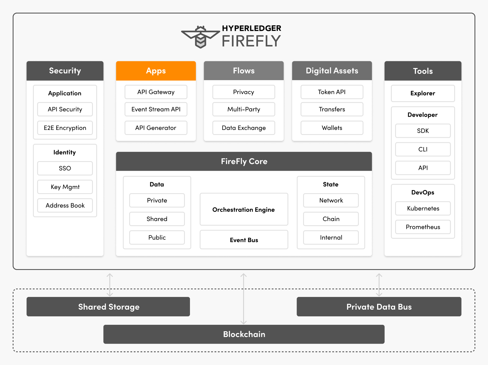

## Apps

Rapidly accelerating development of applications is a key feature of Hyperledger FireFly.

The toolkit is designed to support the full-stack of applications in the enterprise Web3
ecosystem, not just the Smart Contract layer.

Business logic APIs, back-office system integrations, and web/mobile user experiences are just
as important to the overall Web3 use case.

These layers require a different developer skill-set to the on-chain Smart Contracts, and those
developers must have the tools they need to work efficiently.

### API Gateway

FireFly provides APIs that:

- Are fast and efficient
- Have rich query support
- Give deterministic outcomes and clear instructions for safe use
- Integrate with your security frameworks like OAuth 2.0 / OpenID Connect single sign-on
- Provide Open API 3 / Swagger definitions
- Come with code SDKs, with rich type information
- Conform as closely as possible to the principles of REST
- Do not pretend to be RESTful in cases when it is impossible to be

> Learn more about **deploying APIs for custom smart contracts** in [this tutorial](../../tutorials/custom_contracts/)

### Event Streams

The reality is that the only programming paradigm that works for a decentralized solutions,
is an event-driven one.

All blockchain technologies are for this reason event-driven programming interfaces at their core.

In an overall solution, those on-chain events must be coordinated with off-chain private
data transfers, and existing core-systems / human workflows.

This means great event support is a must:

- Convenient WebSocket APIs that work for your microservices development stack
- Support for Webhooks to integrated serverless functions
- Integration with your core enterprise message queue (MQ) or enterprise service bus (ESB)
- At-least-once delivery assurance, with simple instructions at the application layer

> Learn all about the Hyperledger FireFly **Event Bus**, and **event-driven application architecture**,
> in [this reference section](../../reference/events.md)

### API Generation

The blockchain is going to be at the heart of your Web3 project. While usually small in overall surface
area compared to the lines of code in the traditional application tiers, this kernel of
mission-critical code is what makes your solution transformational compared to a centralized / Web 2.0 solution.

Whether the smart contract is hand crafted for your project, an existing contract on a public blockchain,
or a built-in pattern of a framework like FireFly - it must be interacted with correctly.

So there can be no room for misinterpretation in the hand-off between the blockchain
Smart Contract specialist, familiar with EVM contracts in Solidity/Vyper, Fabric chaincode
(or maybe even raw block transition logic in Rust or Go), and the backend / full-stack
application developer / core-system integrator.

Well documented APIs are the modern norm for this, and it is no different for blockchain.

This means Hyperledger FireFly provides:

- Generating the interface for methods and events on your smart contract
- Providing robust transaction submission, and event streaming
- Publishing the API, version, and location, of your smart contracts to the network
