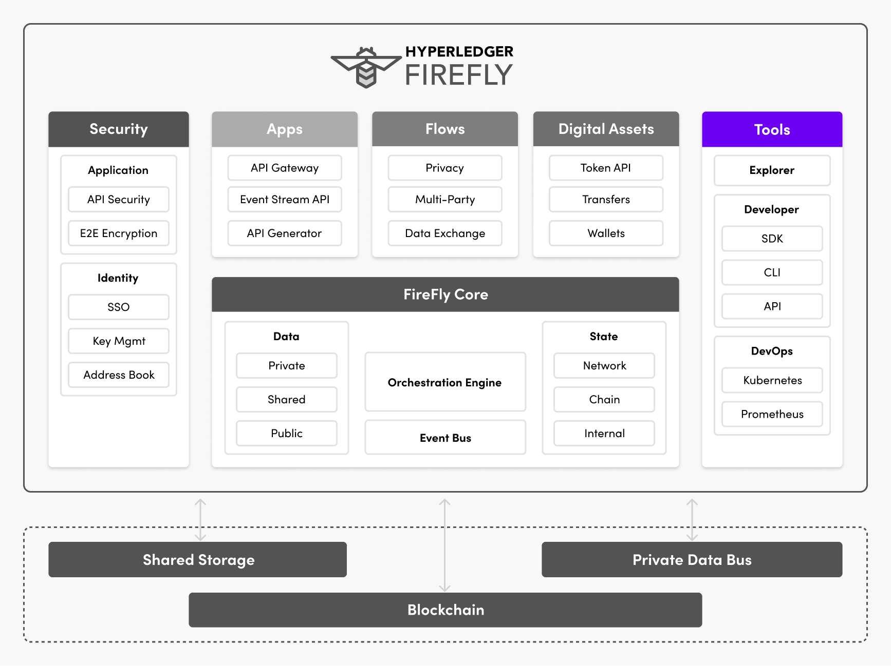
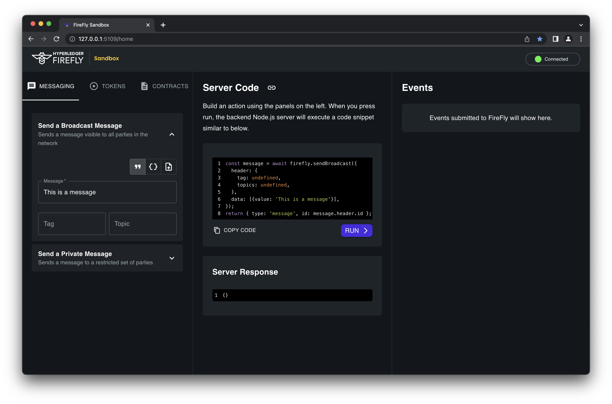

## FireFly CLI

The FireFly CLI can be used to create local FireFly stacks for offline development of blockchain apps. This allows developers to rapidly iterate on their idea without needing to set up a bunch of infrastructure before they can write the first line of code.

## FireFly Sandbox

The FireFly Sandbox sits logically outside the Supernode, and it acts like an "end-user" application written to use FireFly's API. In your setup, you have one Sandbox per member, each talking to their own FireFly API. The purpose of the Sandbox is to provide a quick and easy way to try out all of the fundamental building blocks that FireFly provides. It also shows developers, through example code snippets, how they would implement the same functionality in their own app's backend.

> 🗒 Technical details: The FireFly Sandbox is an example "full-stack" web app. It has a backend written in TypeScript / Node.js, and a frontend in TypeScript / React. When you click a button in your browser, the frontend makes a request to the backend, which then uses the [FireFly Node.js SDK](https://www.npmjs.com/package/@hyperledger/firefly-sdk) to make requests to FireFly's API.

## FireFly Explorer

The FireFly explorer is a part of FireFly Core itself. It is a view into the system that allows operators to monitor the current state of the system and investigate specific transactions, messages, and events. It is also a great way for developers to see the results of running their code against FireFly's API.

