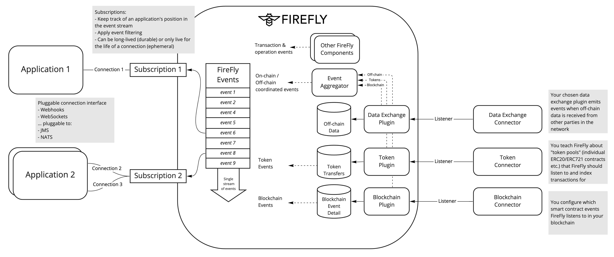
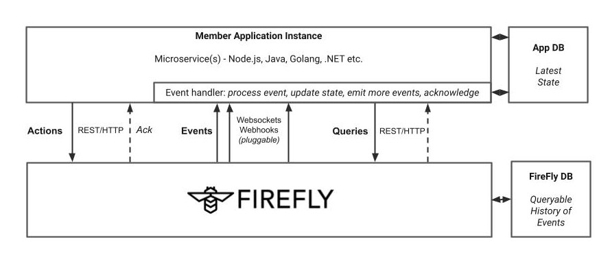
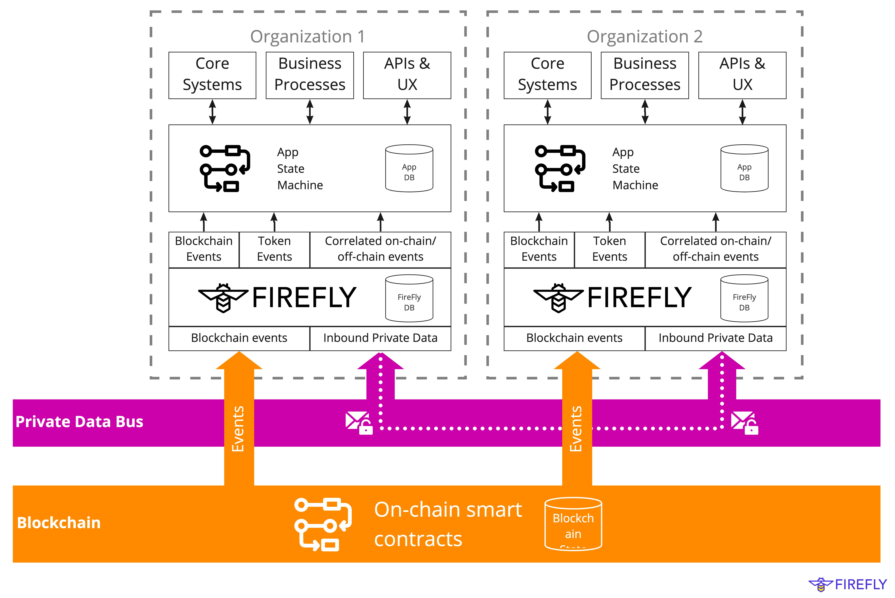

# Event Bus

## Hyperledger FireFly Event Bus

The FireFly event bus provides your application with a single stream of events
from all of the back-end services that plug into FireFly.

Applications subscribe to these events using developer friendly protocols
like WebSockets, and Webhooks. Additional transports and messaging systems
like NATS, Kafka, and JMS Servers can be connected through plugins.

Each application creates one or more [Subscriptions](./types/subscription.md)
to identify itself.
In this subscription the application can choose to receive all events that
are emitted within a `namespace`, or can use server-side filtering to
only receive a sub-set of events.

The event bus reliably keeps track of which events have been delivered to which
applications, via an `offset` into the main event stream that is updated
each time an application acknowledges receipt of events over its subscription.

## Event-Driven Application Architecture

Decentralized applications are built around a source of truth that is
shared between multiple parties. No one party can change the state
unilaterally, as their changes need to be processed in order with
the other changes in the system. Each party processes requests to change
shared state in the same order, against a common set of rules for what
is allowed at that exact point in the processing.
As a result everybody deterministically ends up
with the same state at the end of the processing.

This requires an **event-driven programming** model.

You will find an event-driven model at the core of every blockchain
Smart Contract technology.

This event-driven approach is unavoidable regardless of how much of
your business data & logic can be directly stored/processed
on-chain, vs. off-chain.

So Hyperledger FireFly aims to provide you with the tools to easily
manage this model throughout your decentralized application stack.

Your back-end application should be structured for this event-driven
paradigm, with an **Event Handler** constantly listening for events,
applying a consistent **State Machine** to those events and
applying the changes to your **Application Database**.

> FireFly comes with a built in event processor for Token transfers &
> approvals, that implements this pattern to maintain balances, and
> transaction history in a rich query off-chain data cache.

## Decentralized Event Processing

In a decentralized system, you need to consider that each organization
runs its own applications, and has its own private database.

At any given point in time different organizations will have slightly
different views of what the most up to date information is - even for
the blockchain state.

As well as the agreed business logic, there will be private data
and core system integration that are needed to process events as they
happen. Some of this data might be received privately from other
parties, over a secure communications channel (not the blockchain).

The system must be **eventually consistent** across all parties for any business
data/decision that those parties need to agree on. This happens by all parties
processing the same events in the same order, and by applying the same business
logic (for the parts of the business logic that are agreed).

This means that when processing an event, a participant must have access to enough
historical data/state to reach the same conclusion as everyone else.

Let's look at a couple of examples.

### Example 1: A fungible token balance transfer

You need to be able to verify the complete lineage of the tokens being spent,
in order to know that they cannot be double spent anywhere in the network.

This means the transaction must be backed by a blockchain verifiable by all participants
on the network that could hold balances of that token.

You might be able to use advanced cryptography (such as zero-knowledge proofs)
to mask the participants in the trade, but the transaction themselves must be verifiable
to everyone in a global sequence that prevents double spending.

### Example 2: A step in a multi-party business process

Here it is likely you want to restrict visibility of the data to just the parties directly
involved in the business process.

To come to a common agreement on outcome, the parties must know they are
processing the same data in the same order. So at minimum a proof (a hash of the data) needs to
"pinned" to a blockchain ledger visible to all participants involved in the process.

You can then choose to put more processing on the blockchain, to enforce some critical
rules in the business state machine that must be executed fairly to prevent one
party from cheating the system. Such as that the highest bid is chosen in a competitive
bidding process, or a minimum set of parties have voted agreement before a
transaction is finalized.

Other steps in the process might include human decision making, private data from the core
systems of one member, or proprietary business logic that one member is not willing to share.
These steps are "non-deterministic" - you cannot predict the outcome, nor be guaranteed
to reproduce the same outcome with the same inputs in the future.

The FireFly event bus is designed to make triggering these non-deterministic steps
easy, while still allowing them to be part of the overall state machine of the
business process. You need to take care that the system is designed so parties cannot
cheat, and must follow the rules. How much of that rule enforcement
needs to be executed on-chain vs. off-chain (backed by a deterministic order
through the blockchain) is different for each use case.

> Remember that tokens provide a great set of building blocks for on-chain steps in
> your decentralized applications. Enterprise NFTs allow generation of a globally
> unique ID, and track ownership. Fungible tokens allow value transfer, and can be
> extended with smart contracts that to lock/unlock funds in "digital escrow"
> while complex off-chain agreement happens.

## Privacy groups and late join

If a new participant needs to join into a business transaction that has already
started, they must first "catch up" with the current state before they can play
their part. In a real-world scenario they might not be allowed to see all the
data that's visible to the other parties, so it is common to create a new stream
of communications that includes all of the existing parties, plus the new party,
to continue the process.

If you use the same blockchain to back both groups, then you can safely order business
process steps that involve different parties across these overlapping groups of
participants.

> Using a single Ethereum permissioned side-chain for example.

Alternatively, you can create dedicated distributed ledgers (DLTs) for communication
between these groups of participants. This can allow more logic and data to go
on-chain directly, although you still must consider the fact that this data is
immutable and can never be deleted.

> Using Hyperledger Fabric channels for example.

On top of either type of ledger, FireFly provides a private [Group](./types/group.md)
construct to facilitate secure off-chain data exchanges, and to efficiently
pin these communications to the blockchain in batches.

These private data exchanges can also be coordinated with most sophisticated
on-chain transactions, such as token transfers.

## Event Types

FireFly provides a number of different types of events to your application,
designed to allow you to build your application _state machine_ quickly
and reliably.

All events in FireFly share a common base structure, regardless of their type.
They are then linked (via a `reference`) to an object that contains detailed
information.

The categories of event your application can receive are as follows:

> See the [Core Resources/Event](./types/event.md) page for a full list of event types,
> and more details on the data you can expect for each type.

### Blockchain events

FireFly allows your application to subscribe to any event from a blockchain
smart contract.

In order for applications connected to the FireFly API to receive blockchain events
from a smart contracts, a [ContractListener](./types/contractlistener.md) fist must be created to instruct
FireFly to listen to those events from the blockchain (via the blockchain plugin).

Once you have configured the blockchain event listener, every event detected
from the blockchain will result in a FireFly event delivered to your application
of type `blockchain_event_received`.

Check out the [Custom Contracts Tutorial](../tutorials/custom_contracts/index.md) for
a walk-through of how to set up listeners for the events from your smart contracts.

FireFly automatically establishes listeners for some blockchain events:

- Events from the FireFly `BatchPin` contract that is used to pin identities,
  off-chain data broadcast and private messaging to the blockchain.

- Events from Token contracts, for which a [Token Pool](./types/tokenpool.md)
  has been configured. These events are detected indirectly via the token connector.

### Token events

FireFly provides a Wallet API, that is pluggable to multiple token implementations
without needing to change your app.

The pluggable API/Event interface allows all kinds of technical implementations
of tokens to be fitted into a common framework.

The following wallet operations are supported. These are universal to all
token implementations - NFTs and fungible tokens alike:

- Mint
- Burn
- Transfer
- Approve

FireFly processes, indexes and stores the events associated with these actions,
for any [Token Pool](./types/tokenpool.md) that has been configured on the FireFly node.

See [Token Transfer](./types/tokentransfer.md) and [Token Approval](./types/tokenapproval.md)
for more information on the individual operations.

The token connector is responsible for mapping from the raw Blockchain Events, to the
FireFly model for tokens. Reference token connector implementations are provided for
common interface standards implemented by tokens - like ERC-20, ERC-721 and ERC-115.

A particular token contract might have many additional features that
are unique to that contract, particularly around governance. For these you
would use the Smart Contract features of FireFly to interact with the blockchain
API and Events directly.

## Message events: on-chain / off-chain coordinated

Event aggregation between data arriving off-chain, and the associated ordered
proof/transaction events being confirmed on-chain, is a complex orchestration task.

The universal order and additional transaction logic **on-chain must be the
source of truth** for when and how an event is processed.

However, that event cannot be processed until the off-chain private/broadcast data
associated with that event is also available and verified against the on-chain hash
of that additional data.

They might arrive in any order, and no further events can be processed on that business
transaction until the data is available.

Multiple parties might be emitting events as part of the business transaction, and
the outcome will only be assured to be the same by all parties if they process these
events in the same order.

Hyperledger FireFly handles this for you. Events related to a message
are not emitted until both the on-chain and off-chain parts (including large binary
attachments) are available+verified in your local FireFly node, _and_ all previous
messages on the same `topic` have been processed successfully by your application.

Your application just needs to:

1. Choose a suitable `topic` for your messages that determines the ordered stream
   it is part of. Such as a business transaction identifier.
2. Make sure the application does not acknowledge a message, until it has finished
   processing it.

> See [Message](./types/message.md) for more information

## Transaction submission events

These events are emitted each time a new transaction is initiated via the Firefly API.

These events are only emitted on the local FireFly node that initiates an activity.

For more information about FireFly Transactions, and how they relate to blockchain
transactions, see [Transaction](./types/transaction.md).
