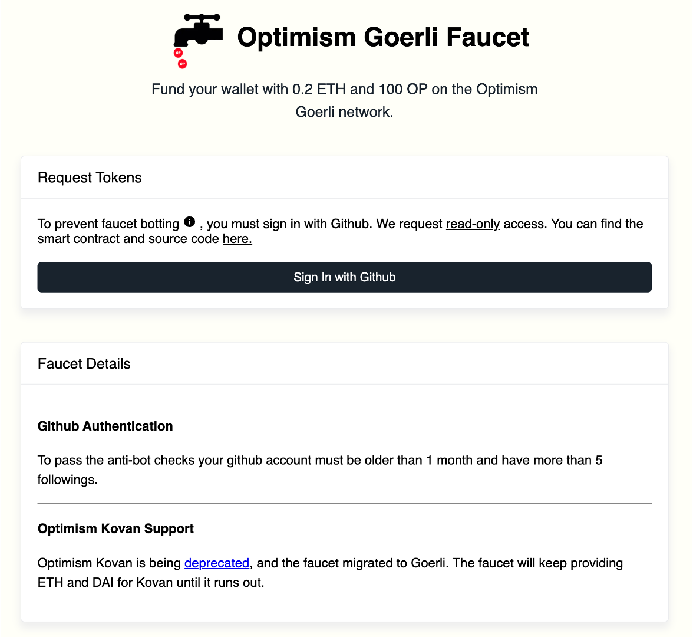
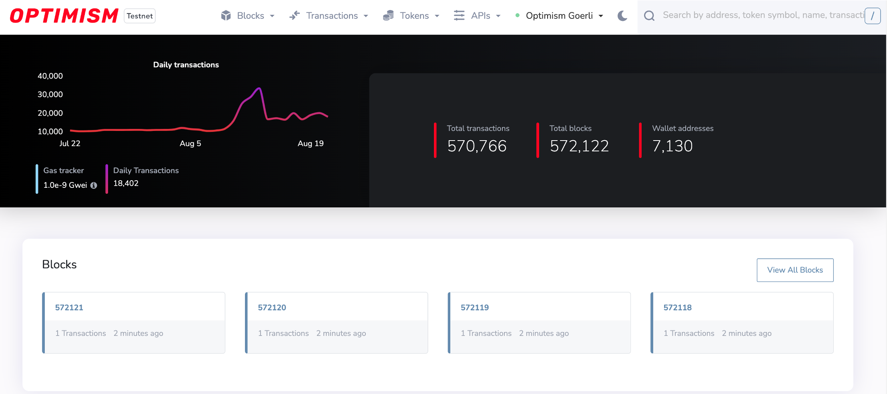

Starting with FireFly v1.1, it's easy to connect to public Ethereum chains. This guide will walk you through the steps to create a local FireFly development environment and connect it to the Optimism Goerli testnet.

## Previous steps: Install the FireFly CLI

If you haven't set up the FireFly CLI already, please go back to the Getting Started guide and read the section on how to [Install the FireFly CLI](../../gettingstarted/firefly_cli.md).

[← ① Install the FireFly CLI](../../gettingstarted/firefly_cli.md){: .md-button .md-button--primary}

## Create an `evmconnect.yml` config file

In order to connect to the Optimism testnet, you will need to set a few configuration options for the evmconnect blockchain connector. Create a text file called `evmconnect.yml` with the following contents:

```yml
confirmations:
  required: 4 # choose the number of confirmations you require
policyengine.simple:
  fixedGasPrice: null
  gasOracle:
    mode: connector
```

For this tutorial, we will assume this file is saved at `~/Desktop/evmconnect.yml`. If your path is different, you will need to adjust the path in the next command below.

## Creating a new stack

To create a local FireFly development stack and connect it to the Optimism testnet, we will use command line flags to customize the following settings:

- Create a new Ethereum based stack named `optimism` with `1` member
- Disable `multiparty` mode. We are going to be using this FireFly node as a Web3 gateway, and we don't need to communicate with a consortium here
- Use an remote RPC node. This will create a signer locally, so that our signing key never leaves the development machine.
- See the optimism [docs](https://community.optimism.io/docs/useful-tools/networks/) and select an HTTPS RPC endpoint.
- Set the chain ID to `420` (the correct ID for the Optimism testnet)
- Merge the custom config created above with the generated `evmconnect` config file

To do this, run the following command:

```
ff init ethereum optimism 1 \
    --multiparty=false \
    -n remote-rpc \
    --remote-node-url <selected RPC endpoint> \
    --chain-id 420 \
    --connector-config ~/Desktop/evmconnect.yml
```

## Start the stack

Now you should be able to start your stack by running:

```
ff start optimism
```

After some time it should print out the following:

```
Web UI for member '0': http://127.0.0.1:5000/ui
Sandbox UI for member '0': http://127.0.0.1:5109


To see logs for your stack run:

ff logs optimism
```

## Get some Optimism

At this point you should have a working FireFly stack, talking to a public chain. However, you won't be able to run any transactions just yet, because you don't have any way to pay for gas. A testnet faucet can give us some OP, the native token for Optimism.

First, you will need to know what signing address your FireFly node is using. To check that, you can run:

```
ff accounts list optimism
[
  {
    "address": "0x235461d246ab95d367925b4e91bd2755a921fdd8",
    "privateKey": "..."
  }
]
```

Copy the address listed in the output from this command. Go to [https://optimismfaucet.xyz/](https://optimismfaucet.xyz/). You will need to login to your Github account and paste the address in the form.



### Confirm the transaction on Blockcscout

You should be able to go lookup your account on [Blockscout for Optimism testnet https://blockscout.com/optimism/goerli](https://blockscout.com/optimism/goerli) and see that you now have a balance of 100 OP. Simply paste in your account address to search for it.



## Use the public testnet

Now that you have everything set up, you can follow one of the other FireFly guides such as [Using Tokens](../tokens/index.md) or [Custom Smart Contracts](../custom_contracts/ethereum.md). For detailed instructions on deploying a custom smart contract to Optimism, please see the [Optimism docs](https://community.optimism.io/docs/developers/build/system-contracts/#getting-contract-artifacts-interfaces-and-abis) for instructions using various tools.
