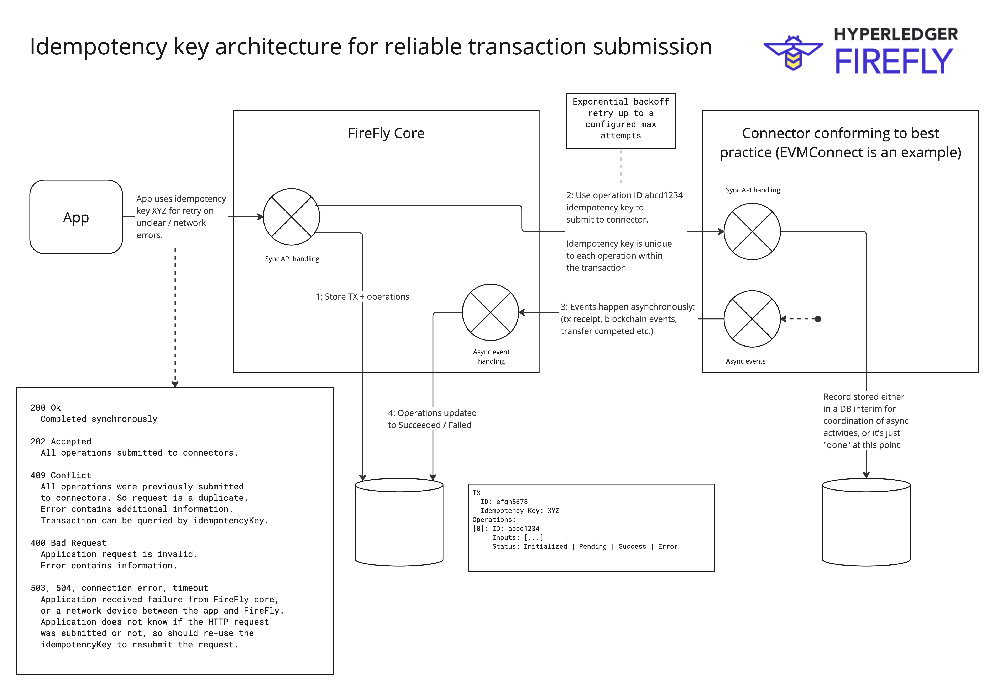

# Idempotency Keys
{: .no_toc }

## Table of contents
{: .no_toc .text-delta }

1. TOC
{:toc}

---

## Idempotency

The transaction submission REST APIs of Hyperledger FireFly are idempotent.

Idempotent APIs allow an application to safely submit a request multiple times, and for the transaction
to only be accepted and executed once.

This is the well accepted approach for REST APIs over HTTP/HTTPS to achieve resilience, as HTTP requests
can fail in indeterminate ways. For example in a request or gateway timeout situation, the requester is
unable to know whether the request will or will not eventually be processed.

There are various types of FireFly [transaction](../reference/types/transaction.html) that can be submitted.
These include direct submission of blockchain transactions to a smart contract, as well as more complex
transactions including coordination of multiple [operations](../reference/types/operation.html)
across on-chain and off-chain connectors.

In order for Hyperledger FireFly to deduplicate transactions, and make them idempotent, the application
must supply an `idempotencyKey` on each API request.

## FireFly Idempotency Keys

The caller of the API specifies its own unique identifier (an arbitrary string up to 256 characters)
that uniquely identifies the request, in the `idempotencyKey` field of the API.

So if there is a network connectivity failure, or an abrupt termination of either runtime, the application
can safely attempt to resubmit the REST API call and be returned a `409 Conflict` HTTP code.

Examples of how an app might construct such an idempotencyKey include:
- Unique business identifiers from the request that comes into its API up-stream - passing idempotency along the chain
- A hash of the business unique data that relates to the request - maybe all the input data of a blockchain transaction for example, if that payload is guaranteed to be unique.
    > Be careful of cases where the business data might _not_ be unique - like a transfer of 10 coins from A to B.
    > 
    > Such a transfer could happen multiple times, and each would be a separate business transaction.
    > 
    > Where as transfer with invoice number `abcd1234` of 10 coins from A to B would be assured to be unique.
- A unique identifier of a business transaction generated within the application and stored in its database before submission
    > This moves the challenge up one layer into your application. How does that unique ID get generated? Is that
    > itself idempotent?

## Operation Idempotency

FireFly provides an idempotent interface downstream to connectors.

Each [operation](../reference/types/operation.html) within a FireFly [transaction](../reference/types/transaction.html)
receives a unique ID within the overall that is used as an idempotency key when invoking that connector.

Well formed connectors honor this idempotency key internally, ensuring that the end-to-end transaction submission is
idempotent.

Key examples of such connectors are EVMConnect and others built on the
[Blockchain Connector Toolkit](../architecture/blockchain_connector_framework.html).

When an operation is retried automatically, the same idempotency key is re-used to avoid resubmission.

## Short term retry

The FireFly core uses standard HTTP request code to communicate with all connector APIs.

This code include exponential backoff retry, that can be enabled with a simple boolean in the plugin
of FireFly core. The minimum retry, maximum retry, and backoff factor can be tuned individually
as well on each connector.

See [Configuration Reference](../reference/config.html) for more information.

## Administrative operation retry

The `operations/{operationId}/retry` API can be called administratively to resubmit a
transaction that has reached `Failed` status, or otherwise been determined by an operator/monitor to be
unrecoverable within the connector.

In this case, the previous operation is marked `Retried`, a new operation ID is allocated, and 
the operation is re-submitted to the connector with this new ID.

