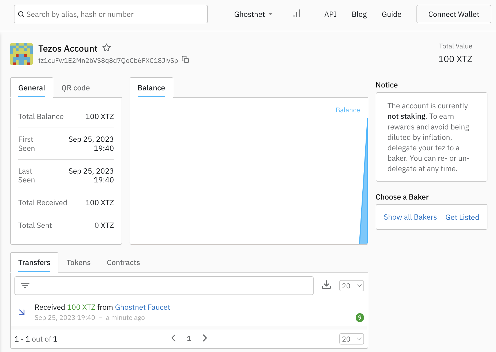

# 
{: .no_toc }

1. TOC
{:toc}

---

This guide will walk you through the steps to create a local FireFly development environment and connect it to the public Tezos Ghostnet testnet.

## Previous steps: Install the FireFly CLI

If you haven't set up the FireFly CLI already, please go back to the Getting Started guide and read the section on how to [Install the FireFly CLI](../../gettingstarted/firefly_cli.md).

[← ① Install the FireFly CLI](../../gettingstarted/firefly_cli.md){: .btn .btn-purple .mb-5}

## Set up the transaction signing service <a name="signatory"></a>

[Signatory](https://signatory.io/) service allows to work with many different key-management systems.
You should choose and set up an appropriate one.
For development/prototyping purposes the easiest way is to use [local signing](https://signatory.io/docs/file_based) option.
Note: tezos accounts (private/public keys) should be generated by chosen KMS.

## Create a `tezosconnect.yml` config file

In order to connect to the Tezos testnet, you will need to set a few configuration options for the tezosonnect blockchain connector. Create a text file called `tezosconnect.yml` with the following contents:

```yml
connector:
  blockchain:
    rpc: https://rpc.ghost.tzstats.com
    network: ghostnet
    signatory: http://127.0.0.1:6732 # address of the transaction signing service
```

For this tutorial, we will assume this file is saved at `~/Desktop/tezosonnect.yml`. If your path is different, you will need to adjust the path in the next command below.

## Creating a new stack

To create a local FireFly development stack and connect it to the Tezos Ghostnet testnet, we will use command line flags to customize the following settings:

- Create a new Tezos based stack named `tezos` with `1` member
- Disable `multiparty` mode. We are going to be using this FireFly node as a Web3 gateway, and we don't need to communicate with a consortium here
- Merge the custom config created above with the generated `tezosonnect` config file

To do this, run the following command:

```
ff init ethereum tezos 1 \
    --multiparty=false \
    --connector-config ~/Desktop/tezosonnect.yml
```

## Start the stack

Now you should be able to start your stack by running:

```
ff start tezos
```

After some time it should print out the following:

```
Web UI for member '0': http://127.0.0.1:5000/ui
Sandbox UI for member '0': http://127.0.0.1:5109


To see logs for your stack run:

ff logs tezos
```

## Get some XTZ

At this point you should have a working FireFly stack, talking to a public chain. However, you won't be able to run any transactions just yet, because you don't have any way to pay transaction fee. A testnet faucet can give us some XTZ, the native token for Tezos.

First, you need to get an account address, which was created during [this](#signatory) step.

After that, go to [Tezos Ghostnet Faucet](https://faucet.ghostnet.teztnets.xyz/) and paste the address in the form and click the **Request** button.


### Confirm the transaction on TzStats
You should be able to go lookup your account on [TzStats for the Ghostnet testnet](https://ghost.tzstats.com/) and see that you now have a balance of 100 XTZ (or 2001 XTZ accordingly). Simply paste in your account address to search for it.

On the **Transfers** tab from you account page you will see the actual transfer of the XTZ from the faucet.

